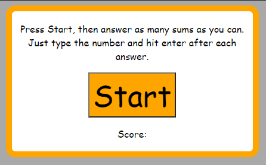
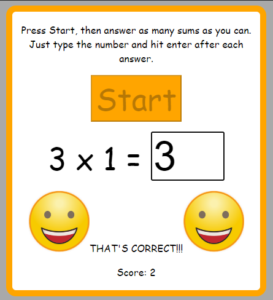

# Introduction
A web based game to help learn times tables.

This is a simple, lightweight website which quizzes the player in their times tables. It was originally devised to help support Maths learning around KS2.

# Getting Started
## Installation Process
Clone the files to your local machine (or copy them to your own webserver). The website itself is contained in the [site](site) folder.

Alternatively, you can try a hosted release here: https://timestablegame.azurewebsites.net

Or you can deploy it to your own Azure subscription, by default this template will deploy to a Free tier WebApp.  

## System Requirements
If you are installing on a webserver then pretty much any webserver will do.

The web browser needs to be able to use Javascript, so any modern browser will be fine.

## Starting the Game
Open the index.htm file in your browser of choice. The game should open ready to start playing.

## Playing the Game
The player gets a minute to answer as many times-tables sums as they can (up to the 12 times table). Each correct answer scores 1 point.

